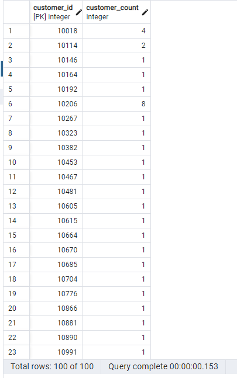
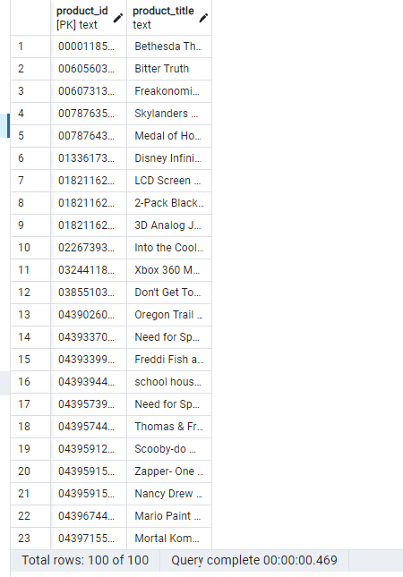
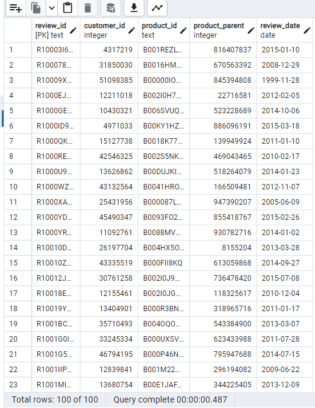
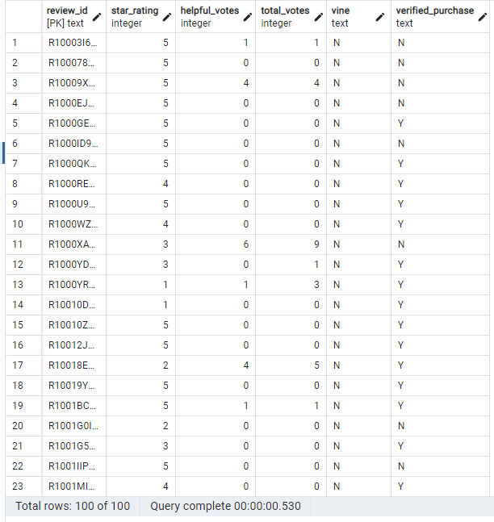
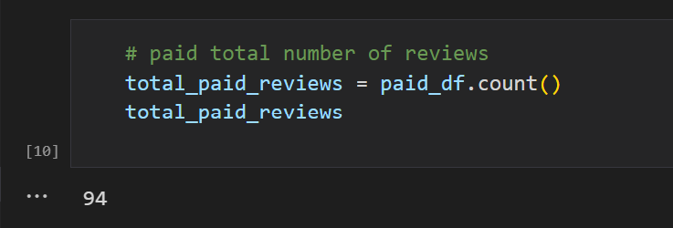
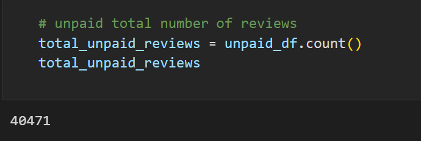
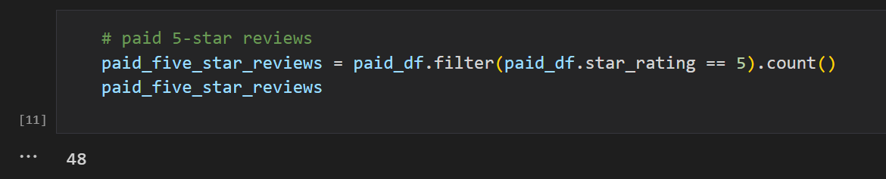
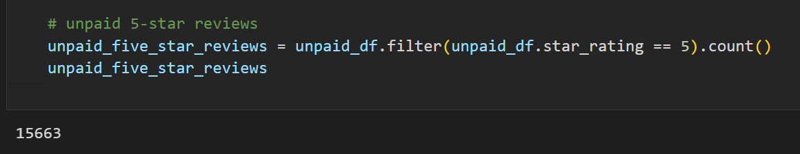
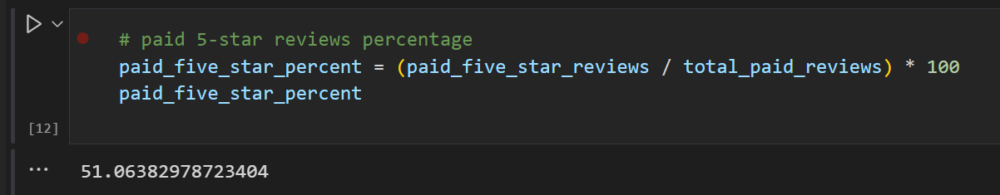
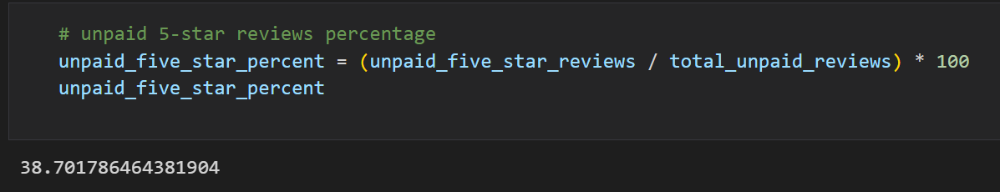

# Amazon_Vine_Analysis
## Overview of the analysis: 
Explain the purpose of this analysis.

The purpose of this project is to analyze written reviews by its members of the paid Amazon Vine program. The Amazon Vine program is a service that allows manufacturers and publishers to receive reviews for their products. A company name SellBy pays Amazon to provide products to Amazon Vine members. These members are invitation only and given a product ship to them at no cost to provide insightful reviews that is honest and unbiased opinions.

This project have  approximately 50 datasets and each one contains reviews of a specific product, from clothing apparel to electornic products. I had picked one of the datasets in video games and use PySpark to perform the ETL process to extract the dataset, transform the data, connect to an AWS RDS instance, and load the transformed data into pgAdmin. Next, I use PySpark, Pandas, or SQL to determine if there is any bias toward favorable reviews from Vine members in your dataset. A summary of analysis is below for stakeholders to review.

## Resources & Tools: 

> * AWS RDS
> * pgAdmin
> * Visual Studio Code
> * Google Colab
> * Dataset link: https://s3.amazonaws.com/amazon-reviews-pds/tsv/amazon_reviews_us_Video_Games_v1_00.tsv.gz

## Results: 
#### Below are analysis process on tables. It is often wise to review the columns on tables before running a complete analysis. The table results will give us an idea what we are working with. 
Customer Table

Products Table

Review ID Table

Vine Table

### How many Vine reviews and non-Vine reviews were there?
> * #### Total Number of Vine Reviews

> * #### Total number of Non-Vine Reviews

> * ### How many Vine reviews were 5 stars? 

> * ### How many non-Vine reviews were 5 stars?

> * ### What percentage of Vine reviews were 5 stars? 

> * ### What percentage of non-Vine reviews were 5 stars?

## Summary: 
In summary, 5 star reviews under the Amazon Vine Program  are 51% whereas the Non-Vine reviews with over 5 star are only 39%. In this case, Amazon Vine program on this analysis of Video Game Reviews is biased.

An additional analysis could be done on the same video games sent to Amazon Vine members and compare the star reviews on Non-Vine members. 

